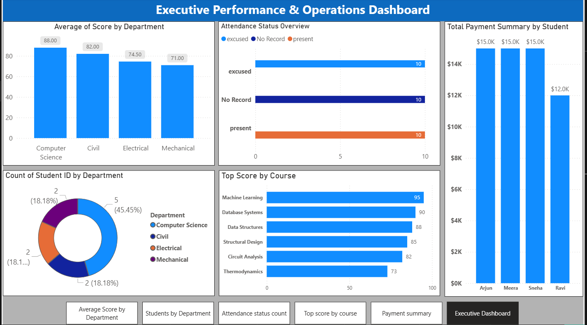

# Student Performance & Operations Analytics Dashboard

An end-to-end data analytics project that cleanses relational database tables, aggregates performance records, and builds an interactive multi-page executive dashboard for educational insights.

## 📊 Dashboard Preview

---

## 📂 Project Repository Structure

Click on any file link below to view the database architecture, source data, or core business intelligence files:

### 1. Core BI & Source Files
* **Power BI Desktop Report:** 🛠️ [Student Grade Power BI.pbix](Student%20Grade%20Power%20BI.pbix) *(Download to view interactive model)*
* **Master SQL Database Script:** 💾 [Student Grade Main.sql](Student%20Grade%20Main.sql) *(Table creations, keys, data constraints, and initial seeding)*

### 2. Relational Database Tables (Source Excel Sheets)
These files represent the core relational database tables staged and modeled inside Power BI:
* 📁 [Student Grade Excel File.xlsx](./Student%20Grade%20Excel%20File.xlsx)

#### Included Database Tables
* 👤 Students Table
* 📚 Courses Table
* 📝 Exams Performance Table
* 📅 Attendance Records Table
* 💳 Financial Payments Table
* 🏫 Enrollments Mapping Table
* 🧑‍🏫 Instructors Table

---

### 3. Aggregated Model Insights & Staging Views
Processed data views used to directly feed the specific visualizations:
* 📁 [Student Grade Excel File.xlsx](./Student%20Grade%20Excel%20File.xlsx)

#### Included Analytical Views
* 📊 Master Analysis Data Table
* 📈 Average Score By Department
* 🏆 Top Scorer By Course View
* 💰 Payment Analysis Metrics
* ⏳ Attendance vs Score Analytics
---

## 🔑 Key Insights Delivered

1.  **Academic Performance:** Identified top-performing engineering domains (Computer Science leading at an 88.00 average) and cataloged peak course metrics.
2.  **Operational Attendance:** Tracked distinct category frequencies across Present, Absent, Excused, and No Record statuses to flag low engagement.
3.  **Financial Summary:** Standardized financial data models to track sum allocations, mapping total student-level financial revenue contributions.

## 🛠️ Tools & Technologies Used
* **Database Engine:** Microsoft SQL Server (Relational Design, Primary/Foreign Key mappings)
* **Data Staging & ETL:** Microsoft Excel & Power Query
* **Business Intelligence:** Power BI Desktop (Data Modeling, Page Navigation, Custom Data Labels)
* **Version Control:** Git & GitHub

 ## 📬 Project Overview
* This project demonstrates a complete analytics workflow:

* **Relational database design**
* **Data cleaning and transformation**
* **Business intelligence reporting**
* **Executive dashboard storytelling**
* **Data-driven operational analysis**

*It is designed as a portfolio-ready Power BI and SQL analytics project suitable for showcasing data modeling, ETL, and visualization skills.
